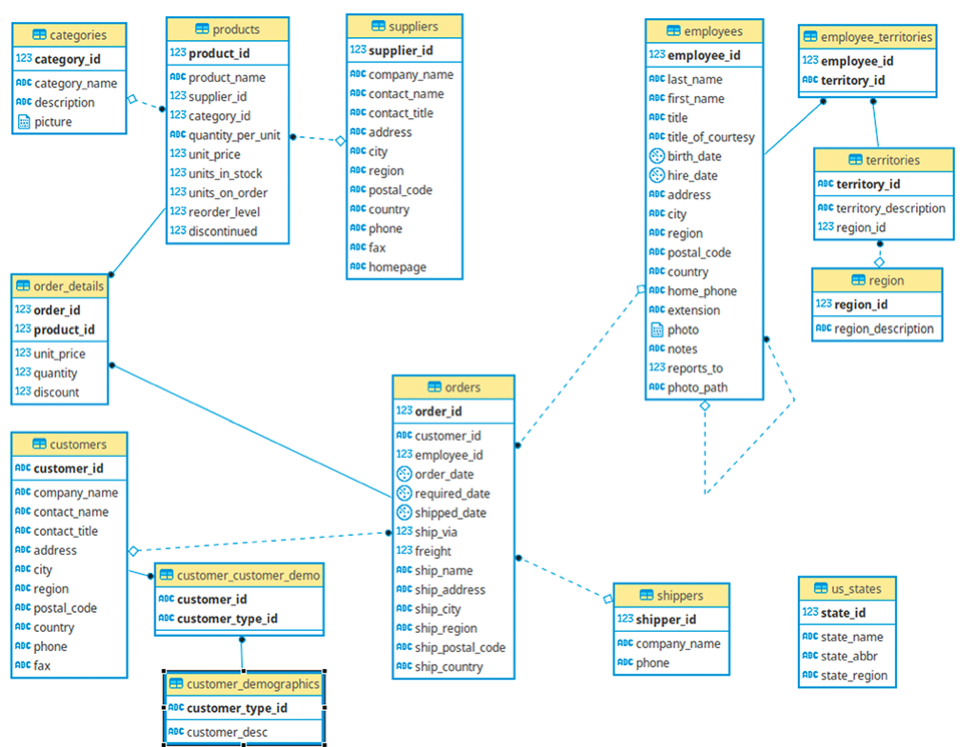

# 📊 Northwind SQL Analytics

SQL project focused on analyzing sales data from the Northwind database to generate business insights.

---

## 🎯 Objective

The goal of this project is to explore and analyze sales data using SQL, applying aggregation, window functions, and segmentation techniques to answer key business questions.

---

## 🧠 Business Questions

This project answers the following questions:

- How does revenue evolve over time?
- What is the monthly growth and year-to-date (YTD) performance?
- Who are the most valuable customers?
- How can customers be segmented based on revenue?
- Which customers should be targeted for marketing actions?
- What are the top-performing products?
- Which countries generate the most revenue?
- Which products sell the most in volume?

---

## 🗂️ Database Schema



---

## 📂 Project Structure

    northwind-sql-analytics/
    │
    ├── data/                # Database scripts
    ├── docs/                # Documentation and images
    ├── queries/             # SQL analysis queries
    ├── docker-compose.yml   # Database environment
    └── README.md

---

## 📊 Analyses

### 01. Monthly Revenue & YTD
- Calculates monthly revenue
- Computes year-to-date accumulation
- Analyzes month-over-month growth

### 02. Customer Revenue
- Calculates total revenue per customer

### 03. Customer Segmentation
- Segments customers into 5 groups using NTILE
- Based on total revenue

### 04. Marketing Customers
- Identifies customers in lower segments (groups 3, 4, 5)
- Supports targeted marketing strategies

### 05. Top Products by Revenue
- Identifies products generating the highest revenue

### 06. High-Value UK Customers
- Filters customers from the UK with total payments above 1000

### 07. Revenue by Country
- Analyzes revenue based on shipping destination
- Helps understand geographic performance

### 08. Top Products by Quantity
- Identifies most sold products by volume
- Complements revenue-based analysis

---

## ⚙️ Setup

### Using Docker

#### Requirements:
- Docker
- Docker Compose

#### Run the project:
```
docker compose up
````
### Access pgAdmin
````
http://localhost:5050
````
**Login:**
```
- Email: pgadmin4@pgadmin.org
```
```
- Password: postgres
```
### Database connection

- Host: db
- User: postgres
- Password: postgres
- Database: northwind
---

## 🧩 Key Concepts Used

- Aggregations (`SUM`, `GROUP BY`)
- Window functions (`NTILE`, `LAG`, `SUM OVER`)
- Data segmentation
- Business-driven analysis
- SQL best practices

---

## 🚀 Conclusion

This project demonstrates how SQL can be used not only to query data, but to generate actionable business insights.

It covers customer behavior, product performance, revenue trends, and segmentation strategies — all essential components for data-driven decision making.

---

## 📌 Author

Flavio Martins